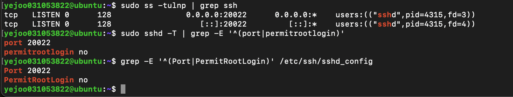
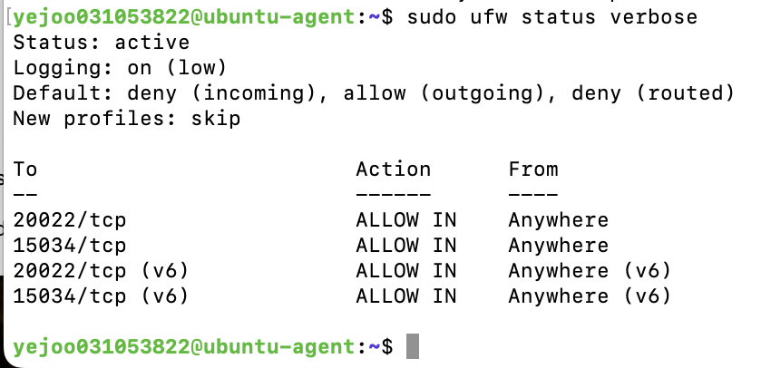
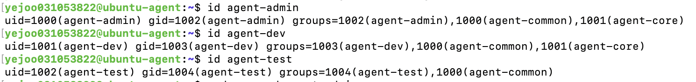
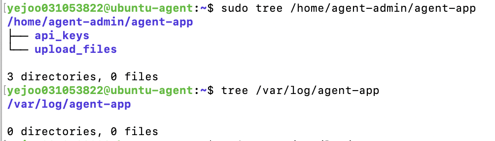
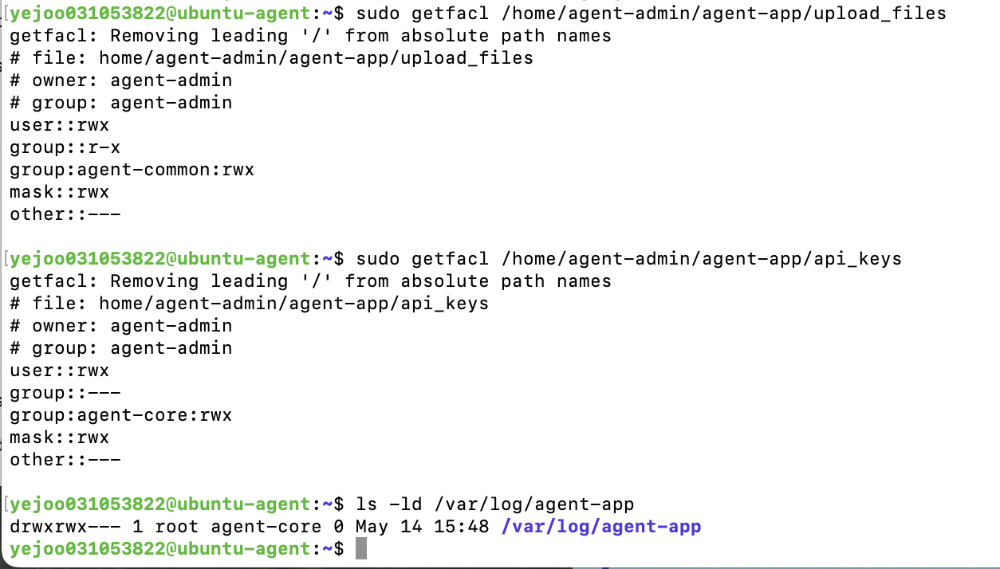
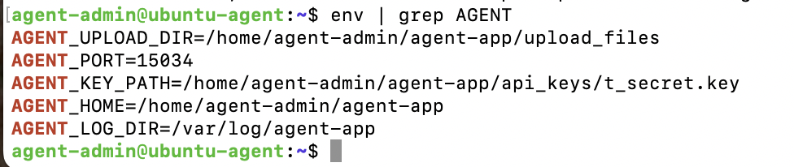
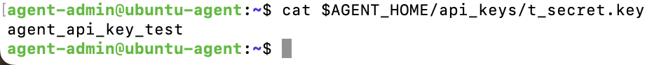
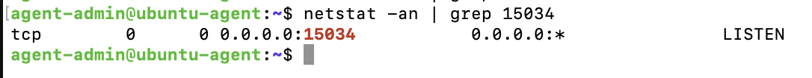

# 요구사항 수행 내역서

## 1. 수행 내역 기록
### 1. SSH 포트 변경(20022) 및 Root 원격 접속 차단 설정
#### (1) 포트 변경 및 Root 원격 접속 차단
SSH 서버의 설정값들이 들어있는 파일에서 설정 변경
```
sudo vim /etc/ssh/sshd_config
```

20022로 포트 변경
```
#Port 22 -> Port 20022
```

Root 접속 차단
```
#PermitRootLogin prohibit-password -> PermitRootLogin no
```

변경 사항 적용: 설정 적용을 위해 ssh 서비스를 재시작 해야한다.
```
sudo systemctl restart ssh
```

#### (2) 수행 내역
**SSH 포트 변경 확인 내역**
- **확인 방법**: `ss-tulnp` 명령어를 통한 포트 리슨 상태 점검
- **증거 지표**
  - 기본 22번 포트가 아닌 문제 요구사항에 지정된 포트 **20022**가 활성화됨
  - 상태가 **LISTEN**으로 표시되어 외부 접속 수신이 가능함을 확인
- **결과 데이터**
  ```text
  yejoo031053822@ubuntu-agent:~$ sudo ss -tulnp | grep sshd
  tcp   LISTEN 0      4096               0.0.0.0:22        0.0.0.0:*    users:(("sshd",pid=4061,fd=3),("systemd",pid=1,fd=51))
  tcp   LISTEN 0      4096                  [::]:22           [::]:*    users:(("sshd",pid=4061,fd=4),("systemd",pid=1,fd=55))
  yejoo031053822@ubuntu-agent:~$ 
  ```

**Root 원격 접속 차단 설정 내역**
- **확인 방법**: `grep PermitRootLogin /etc/ssh/sshd_config` 명령어를 통해 SSH 설정 파일을 열어 PermitRootLogin 항목을 확인
- **결과 데이터**
  ```text
  yejoo031053822@ubuntu-agent:~$ grep PermitRootLogin /etc/ssh/sshd_config
  PermitRootLogin no
  # the setting of "PermitRootLogin prohibit-password".
  yejoo031053822@ubuntu-agent:~$ 
  ```

---
### 2. 방화벽 활성화 및 20022/tcp, 15034/tcp만 허용
#### (1) 방화벽 설정
기본 정책 설정: 모든 들어오는 신호는 일단 막고, 나가는 신호는 허용하는 기본 정책 설정
```
sudo ufw default deny incoming
sudo ufw default allow outgoing
```

과제에서 요구한 필수 포트 허용
```
sudo ufw allow 20022/tcp
sudo ufw allow 15034/tcp
```

방화벽 활성화: 설정한 규칙을 시스템에 실제로 적용한다.
```
sudo ufw enable
```

#### (2) 수행 내역
**방화벽 설정 확인**
- **확인 방법**: `sudo ufw status verbose` 명령어를 통해 방화벽 상태를 확인
- **결과 데이터**
  ```text
  yejoo031053822@ubuntu-agent:~$ sudo ufw status verbose
  Status: active
  Logging: on (low)
  Default: deny (incoming), allow (outgoing), deny (routed)
  New profiles: skip

  To                         Action      From
  --                         ------      ----
  20022/tcp                  ALLOW IN    Anywhere                  
  15034/tcp                  ALLOW IN    Anywhere                  
  20022/tcp (v6)             ALLOW IN    Anywhere (v6)             
  15034/tcp (v6)             ALLOW IN    Anywhere (v6)             

  yejoo031053822@ubuntu-agent:~$       
  ```
---
### 3. 계정/그룹 생성 및 디렉토리 구조 설정 및 권한 설정
#### (1) 계정/그룹 생성 및 권한 설정

**그룹 생성**
```
sudo groupadd agent-common
sudo groupadd agent-core
```

**사용자 생성 및 그룹 배정**
```
sudo useradd -m -G agent-common,agent-core agent-admin
sudo useradd -m -G agent-common,agent-core agent-dev
sudo useradd -m -G agent-common agent-test
```

**디렉토리 구조 생성**
```
sudo mkdir -p /home/agent-admin/agent-app/upload_files
sudo mkdir -p /home/agent-admin/agent-app/api_keys
sudo mkdir -p /var/log/agent-app
```

**접근 권한**
- `upload_files`
```
sudo chown agent-admin:agent-admin /home/agent-admin/agent-app/upload_files
sudo chmod 770 /home/agent-admin/agent-app/upload_files
sudo setfacl -m g:agent-common:rwx /home/agent-admin/agent-app/upload_files
```
- `api_keys`
```
sudo chown agent-admin:agent-admin /home/agent-admin/agent-app/api_keys
sudo chmod 700 /home/agent-admin/agent-app/api_keys
sudo setfacl -m g:agent-core:rwx /home/agent-admin/agent-app/api_keys
```
- `/var/log/agent-app`
```
sudo chown root:agent-core /var/log/agent-app
sudo chmod 770 /var/log/agent-app
```
#### (2) 수행 내역
**사용자 생성 및 그룹 배정**
- **확인 방법**: `id` 명령어를 통해 사용자 생성 및 소속 그룹을 확인 / `
- **결과 데이터**
  ```text
  yejoo031053822@ubuntu-agent:~$ id agent-admin
  uid=1000(agent-admin) gid=1002(agent-admin) groups=1002(agent-admin),1000(agent-common),1001(agent-core)
  yejoo031053822@ubuntu-agent:~$ id agent-dev
  uid=1001(agent-dev) gid=1003(agent-dev) groups=1003(agent-dev),1000(agent-common),1001(agent-core)
  yejoo031053822@ubuntu-agent:~$ id agent-test
  uid=1002(agent-test) gid=1004(agent-test) groups=1004(agent-test),1000(agent-common)
  yejoo031053822@ubuntu-agent:~$ 
  ```
 
**디렉토리 구조**
- **확인 방법**: `tree` 명령어를 이용해 특정 디렉토리 하위 구조를 트리 형태로 출력해서 확인
- **결과 데이터**
  ```text
  yejoo031053822@ubuntu-agent:~$ sudo tree /home/agent-admin/agent-app
  /home/agent-admin/agent-app
  ├── api_keys
  └── upload_files

  3 directories, 0 files
  ```
  ```text
  yejoo031053822@ubuntu-agent:~$ tree /var/log/agent-app
  /var/log/agent-app

  0 directories, 0 files
  ```

**권한 설정**
- **확인 방법**: `getfacl` 명령어를 이용해 소유/권한 확인
- **결과 데이터**
  ```text
  yejoo031053822@ubuntu-agent:~$ sudo getfacl /home/agent-admin/agent-app/upload_files
  getfacl: Removing leading '/' from absolute path names
  # file: home/agent-admin/agent-app/upload_files
  # owner: agent-admin
  # group: agent-admin
  user::rwx
  group::r-x
  group:agent-common:rwx
  mask::rwx
  other::---

  yejoo031053822@ubuntu-agent:~$ sudo getfacl /home/agent-admin/agent-app/api_keys
  getfacl: Removing leading '/' from absolute path names
  # file: home/agent-admin/agent-app/api_keys
  # owner: agent-admin
  # group: agent-admin
  user::rwx
  group::---
  group:agent-core:rwx
  mask::rwx
  other::---

  yejoo031053822@ubuntu-agent:~$ ls -ld /var/log/agent-app
  drwxrwx--- 1 root agent-core 0 May 14 15:48 /var/log/agent-app
  yejoo031053822@ubuntu-agent:~$ 
  ```

---
### 4. 애플리케이션 실행 환경 구성 
#### (1) 애플리케이션 실행 환경 구성
**환경 변수 설정**
agent-admin 계정의 설정 파일(./bashrc)에 환경 변수를 기록
```
agent-admin@ubuntu-agent:~$ cat <<EOF >> ~/.bashrc
export AGENT_HOME=/home/agent-admin/agent-app
export AGENT_PORT=15034
export AGENT_UPLOAD_DIR=\$AGENT_HOME/upload_files
export AGENT_KEY_PATH=\$AGENT_HOME/api_keys/t_secret.key
export AGENT_LOG_DIR=/var/log/agent-app
EOF
agent-admin@ubuntu-agent:~$ 
```
수정한 설정을 현재 터미널 세션에 즉시 적용
```
agent-admin@ubuntu-agent:~$ source ~/.bashrc
```

**키 파일 생성**
```
agent-admin@ubuntu-agent:~$ echo "agent_api_key_test" > $AGENT_KEY_PATH
agent-admin@ubuntu-agent:~$ chmod 600 $AGENT_KEY_PATH
```
(보안을 위해 키 파일 자체의 권한을 본인만 읽을 수 있게 설정함)

**agent-app 파일을 우분투 서버로 옮기기**
```
yejoo031053822@c4r8s8 ~ % scp -P 20022 ~/Downloads/agent-app agent-admin@192.168.139.51:/home/agent-admin/agent-app/
agent-admin@192.168.139.51's password: 
agent-app                                     100% 7741KB  51.4MB/s   00:00    
yejoo031053822@c4r8s8 ~ % 
```

**agent-app 실행**
```
agent-admin@ubuntu-agent:~$ ls -l /home/agent-admin/agent-app
total 7744
-rw-r--r--  1 agent-admin agent-admin 7926296 May 14 18:28 agent-app
drwxrwx---+ 1 agent-admin agent-admin      24 May 14 18:23 api_keys
drwxrwx---+ 1 agent-admin agent-admin       0 May 14 15:48 upload_files
agent-admin@ubuntu-agent:~$ chmod +x $AGENT_HOME/agent-app
agent-admin@ubuntu-agent:~$ $AGENT_HOME/agent-app
```

#### (2) 수행 내역
**환경 변수 설정 확인**
  ```
  agent-admin@ubuntu-agent:~$ env | grep AGENT
  AGENT_UPLOAD_DIR=/home/agent-admin/agent-app/upload_files
  AGENT_PORT=15034
  AGENT_KEY_PATH=/home/agent-admin/agent-app/api_keys/t_secret.key
  AGENT_HOME=/home/agent-admin/agent-app
  AGENT_LOG_DIR=/var/log/agent-app
  agent-admin@ubuntu-agent:~$ 
  ```

**키 파일 생성 확인**
  ```
  agent-admin@ubuntu-agent:~$ cat $AGENT_HOME/api_keys/t_secret.key
  agent_api_key_test
  agent-admin@ubuntu-agent:~$ 
  ```

**앱 실행 및 Boot Sequence 5단계 성공 확인**
  ```
  agent-admin@ubuntu-agent:~$ $AGENT_HOME/agent-app
  >>> Starting Agent Boot Sequence...
  [1/5] Checking User Account               [OK]
   ... Running as service user 'agent-admin' (uid=1000)
  [2/5] Verifying Environment Variables     [OK]
   ... All required Envs correct
  [3/5] Checking Required Files             [OK]
   ... Verified 'secret.key' with correct key string.
  [4/5] Checking Port Availability          [OK]
   ... Port 15034 is available.
  [5/5] Verifying Log Permission            [OK]
   ... Log directory is writable: /var/log/agent-app
  ------------------------------------------------------------
  All Boot Checks Passed!
  Agent READY
  2026-05-14 18:36:23,468 [INFO] [SafetyGuard] Process priority lowered (nice=10).
  ```

**앱 LISTEN 상태 확인**
  ```
  agent-admin@ubuntu-agent:~$ netstat -an | grep 15034
  tcp        0      0 0.0.0.0:15034           0.0.0.0:*               LISTEN     
  agent-admin@ubuntu-agent:~$ 
  ```

## 2. 필수 증거 자료 체크리스트
- [x] SSH 포트 변경(20022) 및 Root 원격 접속 차단 설정 확인 내역
- [x] 방화벽(UFW 또는 firewalld) 활성화 및 20022/tcp, 15034/tcp만 허용 내역
- [x] 계정/그룹(agent-admin/dev/test, agent-common/core) 생성 확인 내역
- [x] 디렉토리 구조 및 권한(ACL 포함) 확인 내역
- [x] 앱 Boot Sequence 5단계 [OK] 및 “Agent READY” 확인 내역
- [ ] monitor.sh 실행 결과(프로세스/포트/리소스/경고) 내역
- [ ] /var/log/agent-app/monitor.log 누적 기록 확인(최근 라인) 내역
- [ ] crontab 매분 실행 등록 및 자동 실행 확인(1분 후 로그 증가) 내역

## 3. 실행 결과 (스크린샷)
### 포트 및 Root 원격 접속 차단 결과


### 방확벽 설정


### 사용자 생성 및 그룹 배정


### 디렉토리 구조 확인


### 권한 부여 확인


### 환경 변수 설정 확인


### api key 파일 생성 확인


### 애플리케이션 실행 Boot Sequence 확인 


### 앱 LISTEN 상태 확인
