# 요구사항 수행 내역서

## 목차
- [0. OrbStack 환경 설정](#0-orbstack-환경-설정)
- [1. SSH 설정](#1-ssh-설정-포트-변경-및-root-원격-로그인-차단)
- [2. 방화벽 활성화](#2-방화벽-활성화)
- [3. 계정/그룹/권한 체계(협업 + 최소 권한)](#3-계정그룹-생성)
- [4. 애플리케이션 실행 환경 구성(제공 Python 앱)](#4-애플리케이션-실행-환경-구성)
- [5. 시스템 관제 자동화 스크립트(monitor.sh) 구현](#5-시스템-관제-자동화-스크립트monitorsh-구현)
- [6. 로그 파일 용량 관리](#6-logrotate-설정)
- [7. 자동 실행(cron) 설정](#7-crontab-매분-실행-및-자동-실행-확인)
- [8. 필수 증거 체크리스트](#8-필수-증거-자료-체크리스트)

## 0. OrbStack 환경 설정
이번 실습에서는 컨테이너 대신 OrbStack을 이용해 Ubuntu Linux 가상머신을 띄워서 인프라 환경을 구축했다. 

Orbstack은 macOS에서 가상머신과 도커 컨테이너를 아주 빠르고 가볍게 돌릴 수 있게 도와주는 관리 도구이다. 
그 위에서 돌아가는 Ubuntu 가상머신은 맥 안에 가상으로 만든 별개의 독립된 컴퓨터라고 보면 된다.

가상머신은 실제 하드웨어 위에 하이퍼바이저라는 층을 두고, 그 위에 독자적인 커널과 OS를 통째로 올려서 완벽한 격리가 된다. 도커는 프로세스를 격리하는 것으로 호스트 커널을 빌려서 사용한다. 

가상머신은 호스트의 커널이 아닌, 자신이 설치한 Ubuntu의 커널을 직접 사용한다. 따라서 자신의 커널이 따로 있으니 마음대로 방화벽을 껐다 켰다 할 수 있고, SSH 포트 변경이나 시스템 로그 관리도 OS 전체를 통제하는 가상머신 환경에서라야 실제 서버처럼 동작한다.

도커는 별도의 커널을 가지지 않고 호스트의 기능을 빌려서 쓴다. 방화벽은 커널의 영역인데 도커는 그 커널을 직접 수정할 권한이 없기 때문에 방화벽 설정 변경 같은 일을 할 수 없다. (만약 도커에서 방화벽을 마음대로 바꿀 수 있다면 옆집 컨테이너의 보안까지 망가뜨릴 수 있기 때문)

### 환경 확인
```
**yejoo031053822@ubuntu**:**~**$ cat /etc/os-release
PRETTY_NAME="Ubuntu 24.04.4 LTS"
NAME="Ubuntu"
VERSION_ID="24.04"
VERSION="24.04.4 LTS (Noble Numbat)"
VERSION_CODENAME=noble
ID=ubuntu
ID_LIKE=debian
HOME_URL="https://www.ubuntu.com/"
SUPPORT_URL="https://help.ubuntu.com/"
BUG_REPORT_URL="https://bugs.launchpad.net/ubuntu/"
PRIVACY_POLICY_URL="https://www.ubuntu.com/legal/terms-and-policies/privacy-policy"
UBUNTU_CODENAME=noble
LOGO=ubuntu-logo
**yejoo031053822@ubuntu**:**~**$ uname -m
x86_64
**yejoo031053822@ubuntu**:**~**$ whoami
yejoo031053822
**yejoo031053822@ubuntu**:**~**$ hostname -I
192.168.139.16 fd07:b51a:cc66:0:e4f5:87ff:fe8f:a8bf
**yejoo031053822@ubuntu**:**~**$
```
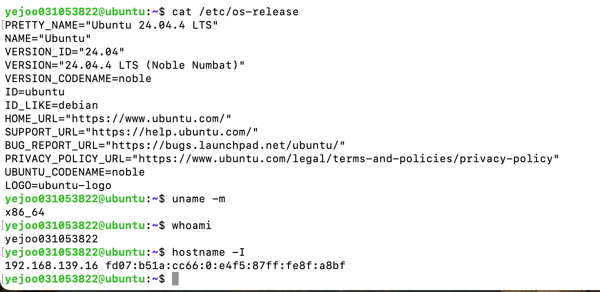

---

## 1. SSH 설정 (포트 변경 및 Root 원격 로그인 차단)
### 1.1 목적
**(1) SSH 포트를 변경하는 이유**

SSH는 네트워크를 통해 다른 컴퓨터에 안전하게 접속해서 명령어를 실행하는 기술로, 리눅스 서버에 원격 접속할 때 사용하는 대표적인 접속 방식이다.

기본 SSH 포트는 보통 22번입니다.

기본값: 22/tcp -> 변경값: 20022/tcp

공격자나 자동화된 봇은 인터넷에 있는 서버들을 대상으로 22번 포트를 계속 스캔한다.
그래서 SSH 포트를 기본값인 22에서 20022로 바꾸면, 무작위 자동 스캔이나 단순 공격 시도를 줄이는 데 도움이 된다.

다만 이건 공격 표면을 줄이는 보조적인 보안 설정으로 완전한 보안 대책은 되지 않는다.

**(2) Root 원격 로그인을 차단하는 이유**

`root`는 리눅스에서 모든 권한을 가진 관리자 계정이다.

만약 외부에서 바로 root 계정으로 SSH 접속이 가능하면, 공격자는 다음처럼 시도할 수 있다.

```
ssh root@서버IP
```

이 경우 공격자가 맞춰야 하는 정보는 사실상 비밀번호 하나뿐이다.

반대로 Root 원격 로그인을 막으면, 서버 관리자는 일반 계정으로 먼저 접속하고 필요한 작업만 sudo로 실행한다.

```
ssh 일반사용자@서버IP -p 20022
sudo 명령어
```

즉, Root 원격 로그인을 차단한 이유는 관리자 계정에 대한 직접 공격을 방지하고, 각 사용자가 개인 계정으로 접속한 뒤 필요한 경우에만 sudo를 사용하도록 하기 위함이다. 

이를 통해 SSH 접속 기록(`sudo journalctl -u ssh`)과 sudo 실행 로그(`sudo journalctl | grep sudo`)를 사용자 계정 기준으로 추적할 수 있으며, 모든 작업을 root 권한으로 수행하는 것보다 실수로 시스템 전체에 영향을 주는 위험을 줄일 수 있다. 이는 사용자와 프로세스에 필요한 최소한의 권한만 부여하는 최소 권한 원칙에 부합한다.

### 1.2 사전 설정
먼저 SSH 서버가 설치되어 있는지 확인한다.
```
yejoo031053822@ubuntu:~$ systemctl status ssh
Unit ssh.service could not be found.
```
SSH 서버가 없으므로 먼저 Ubuntu에 SSH 서버를 설치해야 한다.
```
yejoo031053822@ubuntu:~$ sudo apt update
yejoo031053822@ubuntu:~$ sudo apt install -y openssh-server
```
`sudo apt update`
- `apt`는 Ubuntu의 패키지 관리 도구이다. `apt update`는 프로그램을 설치하는 명령이 아니라, 패키지 목록을 최신화하는 명령이다.
- Ubuntu가 원하는 패키지를 설치하려면 패키지 저장소에서 파일을 받아온다. 이때 로컬에 저장된 패키지 목록이 오래됐을 수도 있으므로 설치 전에 `apt update`를 먼저 실행하는 것이 일반적이다.

### 1.3 SSH 포트 변경 및 Root 원격 로그인 차단

SSH 서버의 설정값들이 들어있는 설정 파일에서 `Port`와 `PermitRootLogin` 설정 변경
```
sudo vim /etc/ssh/sshd_config
```

20022로 포트 변경
```
#Port 22 -> Port 20022
```

Root 접속 차단
```
#PermitRootLogin prohibit-password -> PermitRootLogin no
```

변경 사항 적용: 설정 적용을 위해 SSH 서비스를 재시작 해야한다.
```
sudo systemctl restart ssh
```

### 1.4 검증
```
yejoo031053822@ubuntu:~$ sudo ss -tulnp | grep ssh
tcp   LISTEN 0      128                0.0.0.0:20022      0.0.0.0:*    users:(("sshd",pid=4315,fd=3))           
tcp   LISTEN 0      128                   [::]:20022         [::]:*    users:(("sshd",pid=4315,fd=4))   
yejoo031053822@ubuntu:~$      
```
실제로 서버에서 어떤 포트가 열려 있고, 어떤 프로세스가 그 포트를 사용 중인지 확인한다.
- `ss`: 소켓 상태를 확인하는 명령어
- `-t`: TCP 소켓만 봄
- `-u`: UDP 소켓만 봄
- `-l`: LISTEN 상태인 소켓만 봄 (LISTEN은 서버 프로그램이 해당 포트에서 접속 요청을 기다리는 상태)
- `-n`: 숫자로 표시 (예를 들면, 포트 번호를 서비스 이름으로 바꾸지 않고 숫자로 보여줌)
- `-p`: 해당 포트를 사용 중인 프로세스 정보를 보여줌
-> 실제로 sshd가 20022 포트를 사용 중임을 확인할 수 있다. 

```
yejoo031053822@ubuntu:~$ sudo sshd -T | grep -E '^(port|permitrootlogin)'
port 20022
permitrootlogin no
yejoo031053822@ubuntu:~$ 
```
sshd가 설정 파일들을 모두 읽고 해석한 뒤의 최종 적용 설정값을 보여준다.
- `sshd`: SSH 서버 데몬 프로그램
- `-T`: 테스트 모드로 설정을 출력한다. sshd_config 파일과 include 된 설정들을 모두 반영해서 최종 설정값을 보여준다.
- `| grep -E '^(port|permitrootlogin)'`: 출력 중 `Port`와 `PermitRootLogin`으로 시작하는 줄만 가져온다. 

```
yejoo031053822@ubuntu:~$ grep -E '^(Port|PermitRootLogin)' /etc/ssh/sshd_config
Port 20022
PermitRootLogin no
yejoo031053822@ubuntu:~$ 
```
`/etc/ssh/sshd_config` 파일 안에서 `Port` 또는 `PermitRootLogin`으로 시작하는 줄을 찾는다.
- `grep`: 파일에서 특정 문자열이나 패턴을 찾는 명령어
- `-E`: 확장 정규표현식을 사용하겠다는 옵션. 덕분에 `|` 같은 OR 패턴을 편하게 쓸 수 있다.
- `'^(Port|PermitRootLogin)'`: 정규표현식. 'Port 또는 PermitRootLogin'을 의미한다.


---
## 2. 방화벽 활성화
### 2.1 목적
방화벽은 서버로 들어오거나 나가는 네트워크 트래픽을 허용하거나 차단하는 보안 장치이다.

서버에는 여러 프로그램이 실행될 수 있고, 각 프로그램은 특정 포트에서 요청을 받을 수 있다.
여러 포트가 있을 수 있는데 방화벽이 없거나 모든 포트를 열어두면 외부에서 필요 없는 포트로도 접근을 시도할 수 있다.

따라서 서버 운영에서는 기본적으로 필요한 포트만 열고, 나머지는 차단하는 원칙을 사용한다.

즉, 방화벽 설정의 목적은 필요한 포트만 열고, 나머지 포트는 막는 것으로 서버의 공격 표면을 줄이는 작업이다.

### 2.2 UFW란
UFW란 Uncomplicated Firewall의 약자로 Ubuntu에서 방화벽을 쉽게 설정할 수 있도록 도와주는 도구이다.

실제로 리눅스 내부에서는 `iptables` 또는 `nftables` 같은 방화벽 기능이 동작하는데, 이것들을 직접 다루기는 어렵다. 그래서 Ubuntu에서는 사람이 쓰기 쉬운 명령어로 방화벽 규칙을 관리할 수 있게 ufw를 제공한다.

ufw를 이용해 복잡한 방화벽 규칙을 비교적 쉽게 관리할 수 있다.

### 2.3 UFW 사전 설정
먼저 UFW가 서버에 존재하는지 확인한다.
```
yejoo031053822@ubuntu:~$ ufw version
-bash: ufw: command not found
yejoo031053822@ubuntu:~$
```
없으므로 UFW를 설치한다.
```
yejoo031053822@ubuntu:~$ sudo apt update
Hit:1 http://security.ubuntu.com/ubuntu noble-security InRelease
Hit:2 http://archive.ubuntu.com/ubuntu noble InRelease
Hit:3 http://archive.ubuntu.com/ubuntu noble-updates InRelease
Reading package lists... Done
Building dependency tree... Done
Reading state information... Done
All packages are up to date.
yejoo031053822@ubuntu:~$ sudo apt install -y ufw
yejoo031053822@ubuntu:~$ 
```

### 2.4 방화벽 설정
기본 정책 설정: 모든 들어오는 신호는 일단 막고, 나가는 신호는 허용하는 기본 정책 설정
```
sudo ufw default deny incoming
sudo ufw default allow outgoing
```
- 서버는 여러 프로그램이 여러 포트에서 실행될 수 있어서 여러 포트가 있다. 필요 없는 포트를 열어두면 공격자가 시도할 수 있는 입구가 늘어나서 일단 외부에서 들어오는 요청은 모두 차단하고 인바운드 허용 포트는 따로 허용한다.
- 서버가 `apt update`, 패키지 다운로드, 외부 API 호출 등을 해야 하므로 아웃바운드는 일반적으로 허용한다.

과제에서 요구한 인바운드 허용 포트인 TCP 20022(SSH), TCP 15034(APP)만 허용
```
sudo ufw allow 20022/tcp
sudo ufw allow 15034/tcp
```
- 인바운드 허용 포트란, 서버 안으로 들어오는 네트워크 요청을 의미한다.
- 반대로 서버가 외부 API를 호출하거나 패키지를 다운로드하는 것은 서버 입장에서 아웃바운드이다.

방화벽 활성화: 설정한 규칙을 시스템에 실제로 적용한다.
```
sudo ufw enable
```

### 2.5 설정 내용 정리
- 방화벽 도구: UFW
- 기본 인바운드 정책: deny
- 기본 아웃바운드 정책: allow
- 허용 인바운드 포트:
  - `20022/tcp`: SSH
  - `15034/tcp`: Application

### 2.6 검증
`sudo ufw status` 명령어를 통해 방화벽 상태를 확인할 수 있다.
```
yejoo031053822@ubuntu:~$ sudo ufw status
Status: active

To                         Action      From
--                         ------      ----
20022/tcp                  ALLOW       Anywhere                  
15034/tcp                  ALLOW       Anywhere                  
20022/tcp (v6)             ALLOW       Anywhere (v6)             
15034/tcp (v6)             ALLOW       Anywhere (v6)             

yejoo031053822@ubuntu:~$
```
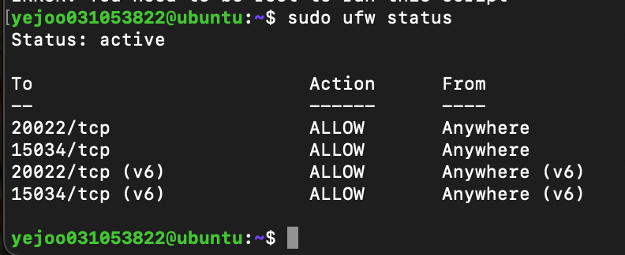

---

## 3. 계정/그룹 생성
### 3.1 목적
서버 운영 환경에서 역할별 권한을 분리하기 위해 `agent-admin`, `agent-dev`, `agent-test` 계정을 생성하였다. 
또한 공유 작업 영역 접근을 위한 `agent-common` 그룹과 핵심 운영 리소스 접근을 위한 `agent-core` 그룹을 생성하였다.

`agent-common`에는 운영, 개발, 테스트 계정을 모두 포함하고, `agent-core`에는 운영 및 개발 계정만 포함하였다.  
이를 통해 테스트 계정은 공용 업로드 디렉토리에는 접근할 수 있지만, API 키나 운영 로그와 같은 핵심 리소스에는 접근하지 못하도록 구성할 수 있다.

### 3.2 그룹 생성
```
yejoo031053822@ubuntu:~$ sudo groupadd agent-common
yejoo031053822@ubuntu:~$ sudo groupadd agent-core
```

### 3.3 계정 생성
계정 생성
```
yejoo031053822@ubuntu:~$ sudo useradd -m agent-admin
yejoo031053822@ubuntu:~$ sudo useradd -m agent-dev
yejoo031053822@ubuntu:~$ sudo useradd -m agent-test
```
- `-m`: 홈 디렉토리 생성. 홈 디렉토리를 생성하면 계정별 설정 파일도 자연스럽게 저장할 수 있다.

각 그룹에 계정 포함
```
yejoo031053822@ubuntu:~$ sudo usermod -aG agent-common agent-admin
yejoo031053822@ubuntu:~$ sudo usermod -aG agent-commont agent-dev
yejoo031053822@ubuntu:~$ sudo usermod -aG agent-common agent-dev
yejoo031053822@ubuntu:~$ sudo usermod -aG agent-common agent-test
yejoo031053822@ubuntu:~$ sudo usermod -aG agent-core agent-admin
yejoo031053822@ubuntu:~$ sudo usermod -aG agent-core agent-dev
```
- `-a`: 기존 그룹을 유지하면서 추가. `useradd`로 사용자를 만들면 보통 사용자 이름과 같은 기본 그룹(primary group)이 자동으로 생성되기 때문. (리눅스에서는 User Private Group 방식으로, 사용자마다 자기 이름의 그룹을 하나씩 만들어서 기본적으로 개인 파일은 자기 계정과 자기 그룹에 속하게 한다. 이렇게 하면 다른 사용자와 권한이 섞이지 않고, 개인 홈 디렉토리 파일을 계정 단위로 분리하기 쉽다.)
- `-G`: 보조 그룹 추가

추가로 각 계정 비밀번호도 생성하였다. 각 계정으로 SSH 로그인을 할 수 있기 때문에 미리 생성하였다.
```
yejoo031053822@ubuntu:~$ sudo passwd agent-admin
New password: 
Retype new password: 
passwd: password updated successfully
yejoo031053822@ubuntu:~$ sudo passwd agent-dev
New password: 
Retype new password: 
passwd: password updated successfully
yejoo031053822@ubuntu:~$ sudo passwd agent-test
New password: 
Retype new password: 
passwd: password updated successfully
yejoo031053822@ubuntu:~$ 
```

### 3.4 계정/그룹 생성 검증
```
yejoo031053822@ubuntu:~$ id agent-admin
uid=1000(agent-admin) gid=1002(agent-admin) groups=1002(agent-admin),1000(agent-common),1001(agent-core)
yejoo031053822@ubuntu:~$ id agent-dev
uid=1001(agent-dev) gid=1003(agent-dev) groups=1003(agent-dev),1000(agent-common),1001(agent-core)
yejoo031053822@ubuntu:~$ id agent-test
uid=1002(agent-test) gid=1004(agent-test) groups=1004(agent-test),1000(agent-common)
yejoo031053822@ubuntu:~$ 
```
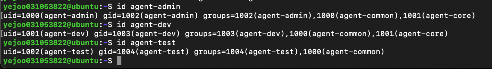

### 3.5 디렉토리 구조 설정
```
yejoo031053822@ubuntu:~$ sudo mkdir -p /home/agent-admin/agent-app/upload_files
yejoo031053822@ubuntu:~$ sudo mkdir -p /home/agent-admin/agent-app/api_keys
yejoo031053822@ubuntu:~$ sudo mkdir -p /home/agent-admin/agent-app/bin
yejoo031053822@ubuntu:~$ sudo mkdir -p /var/log/agent-app
```

### 3.6 디렉토리 구조 출력
```
yejoo031053822@ubuntu:~$ sudo tree -a /home/agent-admin/agent-app
/home/agent-admin/agent-app
├── api_keys
├── bin
└── upload_files

4 directories, 0 files
yejoo031053822@ubuntu:~$
```
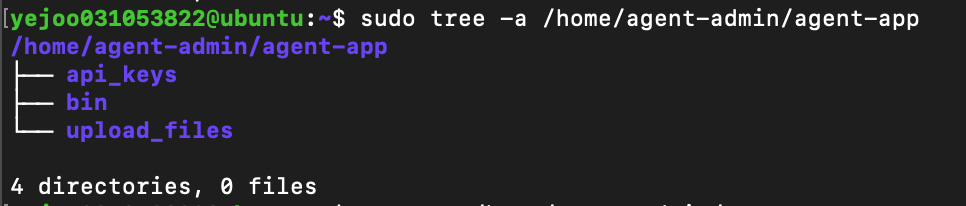

### 3.7 접근 권한 부여
#### `home/agent-admin` 권한 설정
```
yejoo031053822@ubuntu:~$ sudo setfacl -m g:agent-common:--x /home/agent-admin
```
- `/home/agent-admin`은 `agent-admin`의 개인 홈 디렉토리이다. 따라서 소유자:그룹을 보통 `agent-admin:agent-admin`으로 유지한다.
- `agent-common` 그룹의 계정도 `upload_files`까지는 접근해야 하므로, 상위 경로인 `home/agent-admin`에는 `agent-common` 그룹의 통과 권한만 부여한다.
- `-m`: modify, 즉 ACL 규칙을 추가하거나 수정한다는 의미이다.
- `g:agent-common:--x`: `agent-common` 그룹에게 실행 권한만 부여한다.

#### `home/agent-admin/agent-app` 권한 설정
```
yejoo031053822@ubuntu:~$ sudo chown agent-admin:agent-core /home/agent-admin/agent-app
yejoo031053822@ubuntu:~$ sudo chmod 750 /home/agent-admin/agent-app
yejoo031053822@ubuntu:~$ sudo setfacl -m g:agent-common:--x /home/agent-admin/agent-app
```
- `agent-app`은 애플리케이션 기준 디렉토리인데 여기에는 민감한 디렉토리도 있고, 공용 디렉토리도 있다. 그래서 기본적으로는 운영/개발 그룹인 `agent-core` 중심으로 접근하게 두고, `agent-test`는 `upload_files`까지 갈 수 있도록 통과 권한만 준다.
- 소유자:그룹을 `agent-admin:agent-core`로 설정
- `agent-test`도 `upload_files`까지 가야 하므로 ACL을 이용해서 `agent-common`에게 `agent-app` 통과 권한을 준다.
- 이렇게 하면 `agent-test`는 `home/agent-admin/agent-app` 안의 `api_keys`나 `bin` 목록을 불필요하게 노출하지 않으면서, `upload_files`까지 들어갈 수 있다.

#### `home/agent-admin/agent-app/upload_files` 권한 설정
```
yejoo031053822@ubuntu:~$ sudo chown agent-admin:agent-common /home/agent-admin/agent-app/upload_files
yejoo031053822@ubuntu:~$ sudo chmod 2770 /home/agent-admin/agent-app/upload_files
yejoo031053822@ubuntu:~$ sudo setfacl -m d:g:agent-common:rwx /home/agent-admin/agent-app/upload_files
yejoo031053822@ubuntu:~$ sudo setfacl -m d:m:rwx /home/agent-admin/agent-app/upload_files
```
- 소유자:그룹을 `agent-admin:agent-common`으로 설정
- `chmod 2770`에서 2는 setgid로 그 안에 새로 만들어지는 파일/디렉토리가 부모 디렉토리의 그룹을 상속받는다. 이를 통해 그 안에서 누가 파일을 만들든 그룹이 부모 디렉토리의 그룹으로 유지된다.
- 이게 없으면 사용자가 파일을 만들 때 자기 기본 그룹으로 생성될 수 있는데 그러면 다른 계정과 공유가 꼬일 수 있다.
- `d:`: default ACL로, 앞으로 이 디렉토리 안에 새로 만들어지는 파일/디렉토리에도 이 권한 규칙을 기본 적용한다.
- `m:`: mask로, ACL에서 mask는 그룹/ACL 권한의 최대 허용치를 의미한다. mask가 좁게 잡히면 `agent-common:rwx`를 줬어도 실제 쓰기 권한이 제한될 수 있다.그래서 협업 디렉토리에서는 default mask를 rwx로 두는 것이 안전하다.

#### `home/agent-admin/agent-app/api_keys` 권한 설정
```
yejoo031053822@ubuntu:~$ sudo chown agent-admin:agent-core /home/agent-admin/agent-app/api_keys
yejoo031053822@ubuntu:~$ sudo chmod 2770 /home/agent-admin/agent-app/api_keys
yejoo031053822@ubuntu:~$ sudo setfacl -m d:g:agent-core:rwx /home/agent-admin/agent-app/api_keys
yejoo031053822@ubuntu:~$ sudo setfacl -m d:m:rwx /home/agent-admin/agent-app/api_keys
```
- 소유자:그룹을 `agent-admin:agent-core`로 설정
- ACL로 앞으로 생성될 파일/디렉토리에도 `agent-core` 권한이 유지되게 한다.

#### `/var/log/agent-app` 권한 설정
```
yejoo031053822@ubuntu:~$ sudo chown agent-admin:agent-core /var/log/agent-app
yejoo031053822@ubuntu:~$ sudo chmod 2770 /var/log/agent-app
yejoo031053822@ubuntu:~$ sudo setfacl -m d:g:agent-core:rwx /var/log/agent-app
yejoo031053822@ubuntu:~$ sudo setfacl -m d:m:rwx /var/log/agent-app
```
- 소유자:그룹을 `agent-admin:agent-core`로 설정
- ACL로 앞으로 생성될 로그 파일에도 `agent-core` 권한이 유지되게 한다.

### 3.8 권한 점검
```
yejoo031053822@ubuntu:~$ sudo ls -ld /home/agent-admin/agent-app
drwxr-x---+ 1 agent-admin agent-core 46 May 18 16:39 /home/agent-admin/agent-app
yejoo031053822@ubuntu:~$ sudo ls -ld /home/agent-admin/agent-app/upload_files
drwxrws---+ 1 agent-admin agent-common 0 May 18 16:39 /home/agent-admin/agent-app/upload_files
yejoo031053822@ubuntu:~$ sudo ls -ld /home/agent-admin/agent-app/api_keys
drwxrws---+ 1 agent-admin agent-core 0 May 18 16:39 /home/agent-admin/agent-app/api_keys
yejoo031053822@ubuntu:~$ sudo ls -ld /var/log/agent-app
drwxrws---+ 1 agent-admin agent-core 0 May 18 16:39 /var/log/agent-app
yejoo031053822@ubuntu:~$
```
```
yejoo031053822@ubuntu:~$ sudo getfacl /home/agent-admin
getfacl: Removing leading '/' from absolute path names
# file: home/agent-admin
# owner: agent-admin
# group: agent-admin
user::rwx
group::r-x
group:agent-common:--x
mask::r-x
other::---

yejoo031053822@ubuntu:~$ sudo getfacl /home/agent-admin/agent-app
getfacl: Removing leading '/' from absolute path names
# file: home/agent-admin/agent-app
# owner: agent-admin
# group: agent-core
user::rwx
group::r-x
group:agent-common:--x
mask::r-x
other::---

yejoo031053822@ubuntu:~$ sudo getfacl /home/agent-admin/agent-app/upload_files
getfacl: Removing leading '/' from absolute path names
# file: home/agent-admin/agent-app/upload_files
# owner: agent-admin
# group: agent-common
# flags: -s-
user::rwx
group::rwx
other::---
default:user::rwx
default:group::rwx
default:group:agent-common:rwx
default:mask::rwx
default:other::---

yejoo031053822@ubuntu:~$ sudo getfacl /home/agent-admin/agent-app/api_keys
getfacl: Removing leading '/' from absolute path names
# file: home/agent-admin/agent-app/api_keys
# owner: agent-admin
# group: agent-core
# flags: -s-
user::rwx
group::rwx
other::---
default:user::rwx
default:group::rwx
default:group:agent-core:rwx
default:mask::rwx
default:other::---

yejoo031053822@ubuntu:~$ sudo getfacl /var/log/agent-app
getfacl: Removing leading '/' from absolute path names
# file: var/log/agent-app
# owner: agent-admin
# group: agent-core
# flags: -s-
user::rwx
group::rwx
other::---
default:user::rwx
default:group::rwx
default:group:agent-core:rwx
default:mask::rwx
default:other::---

yejoo031053822@ubuntu:~$ 
```
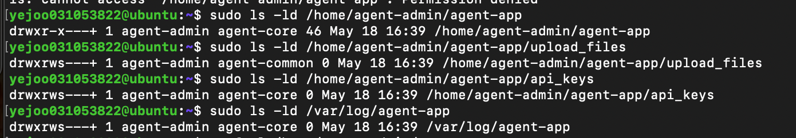
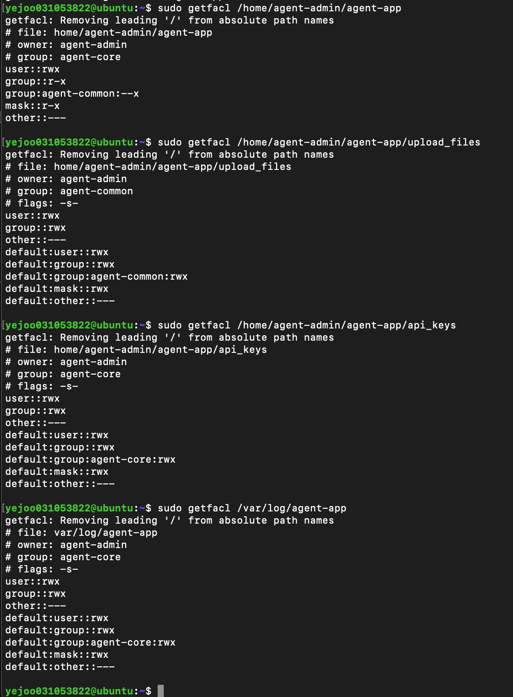

### 3.9 권한 부여 정리
역할 기반 접근 제어를 위해 기본 Unix 권한과 ACL을 함께 사용하였다. `/home/agent-admin`과 `/home/agent-admin/agent-app`에는 `agent-common` 그룹의 통과 권한만 부여하여 `agent-test`가 공용 업로드 디렉토리까지 접근할 수 있도록 하되, 상위 디렉토리 목록 조회는 제한하였다. `upload_files`는 `agent-common` 그룹이 읽기/쓰기 가능하도록 설정하고, `api_keys`와 `/var/log/agent-app`는 `agent-core` 그룹만 읽기/쓰기 가능하도록 설정하였다. 또한 협업 디렉토리에는 setgid와 default ACL을 적용하여 이후 생성되는 파일과 디렉토리도 의도한 그룹 권한을 유지하도록 구성하였다.


---
## 4. 애플리케이션 실행 환경 구성 
### 4.1 사전 설정
OrbStack Ubuntu 서버에서 `agent-app` 앱을 실행하기 위해 Mac에 있는 `agent-app` 파일을 서버 안으로 옮겨야 한다.
```
yejoo031053822@c4r8s8 ~ % scp -P 20022 ~/Downloads/agent-app yejoo031053822@192.168.139.16:/home/yejoo031053822
The authenticity of host '[192.168.139.16]:20022 ([192.168.139.16]:20022)' can't be established.
ED25519 key fingerprint is SHA256:I5z/IaT/O28+JatHwoRUrC58Ew33Gp7wUbTnSNxq3Mg.
This key is not known by any other names.
Are you sure you want to continue connecting (yes/no/[fingerprint])? yes
Warning: Permanently added '[192.168.139.16]:20022' (ED25519) to the list of known hosts.
yejoo031053822@192.168.139.16's password: 
agent-app                                     100% 7741KB  53.4MB/s   00:00    
yejoo031053822@ubuntu:~$ ls -l /home/yejoo031053822/agent-app
-rw-rw-r-- 1 yejoo031053822 yejoo031053822 7926296 May 18 17:40 /home/yejoo031053822/agent-app
yejoo031053822@ubuntu:~$ 
```

파일을 앱 실행 위치로 옮기고 소유자와 그룹을 `agent-admin:agent-core`로 변경한다. 그리고 실행 권한을 부여해준다.
```
yejoo031053822@ubuntu:~$ sudo mv /home/yejoo031053822/agent-app /home/agent-admin/agent-app/agent-app
yejoo031053822@ubuntu:~$ sudo chown agent-admin:agent-core /home/agent-admin/agent-app/agent-app
yejoo031053822@ubuntu:~$ sudo chmod 750 /home/agent-admin/agent-app/agent-app
ejoo031053822@ubuntu:~$ sudo ls -l /home/agent-admin/agent-app/agent-app
-rwxr-x--- 1 agent-admin agent-core 7926296 May 18 17:40 /home/agent-admin/agent-app/agent-app
yejoo031053822@ubuntu:~$ 
```

이제 일반 계정에서 앱을 실행해야 하므로 `agent-admin` 계정으로 전환한다.
SSH를 배웠으므로 ssh 접속을 통해 Ubuntu 서버에 `agent-admin` 계정으로 접속하였다.
```
yejoo031053822@c4r8s8 ~ % ssh -p 20022 agent-admin@192.168.139.16
agent-admin@192.168.139.16's password: 
Welcome to Ubuntu 24.04.4 LTS (GNU/Linux 6.17.8-orbstack-00308-g8f9c941121b1 x86_64)

 * Documentation:  https://help.ubuntu.com
 * Management:     https://landscape.canonical.com
 * Support:        https://ubuntu.com/pro

The programs included with the Ubuntu system are free software;
the exact distribution terms for each program are described in the
individual files in /usr/share/doc/*/copyright.

Ubuntu comes with ABSOLUTELY NO WARRANTY, to the extent permitted by
applicable law.

$ bash
agent-admin@ubuntu:~$ whoami
agent-admin
agent-admin@ubuntu:~$ 
```

### 4.2 환경 변수 설정
리눅스 앱은 실행 시 필요한 설정값들을 환경 변수에서 읽어온다. 따라서 필요한 설정들을 환경 변수로 설정한다.
문제는 환경 변수를 설정하고 그 터미널 세션이 끝나면 환경 변수 설정이 사라진다. 따라서 `agent-admin`의 설정 파일(`/home/agent-admin/.bashrc`)에 환경 변수값을 저장하였다.
`~/.bashrc`는 Bash가 시작될 때 읽는 사용자별 설정 파일이다.
그리고 `~/.bashrc` 파일에 적힌 내용을 현재 터미널 세션에 즉시 적용하였다.

앱 실행을 `agent-admin` 계정에서 해야하므로 `agent-admin` 계정에 환경 변수를 설정하였다.
```
agent-admin@ubuntu:~$ cat <<EOF >> ~/.bashrc
export AGENT_HOME=/home/agent-admin/agent-app
export AGENT_PORT=15034
export AGENT_UPLOAD_DIR=\$AGENT_HOME/upload_files
export AGENT_KEY_PATH=\$AGENT_HOME/api_keys/t_secret.key
export AGENT_LOG_DIR=/var/log/agent-app
EOF
agent-admin@ubuntu:~$ source ~/.bashrc
agent-admin@ubuntu:~$ 
```

### 4.3 환경 변수 검증
```
agent-admin@ubuntu:~$ env | grep AGENT
AGENT_UPLOAD_DIR=/home/agent-admin/agent-app/upload_files
AGENT_PORT=15034
AGENT_KEY_PATH=/home/agent-admin/agent-app/api_keys/t_secret.key
AGENT_HOME=/home/agent-admin/agent-app
AGENT_LOG_DIR=/var/log/agent-app
agent-admin@ubuntu:~$ 
```
현재 환경 변수 목록에서 `AGENT` 관련 설정을 출력해서 확인한다.
```
gent-admin@ubuntu:~$ echo $AGENT_HOME
/home/agent-admin/agent-app
agent-admin@ubuntu:~$ echo $AGENT_PORT
15034
agent-admin@ubuntu:~$ echo $AGENT_UPLOAD_DIR
/home/agent-admin/agent-app/upload_files
agent-admin@ubuntu:~$ echo $AGENT_KEY_PATH
/home/agent-admin/agent-app/api_keys/t_secret.key
agent-admin@ubuntu:~$ echo $AGENT_LOG_DIR
/var/log/agent-app
agent-admin@ubuntu:~$ 
```
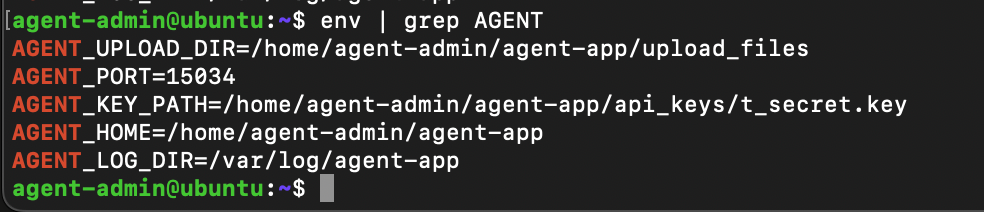
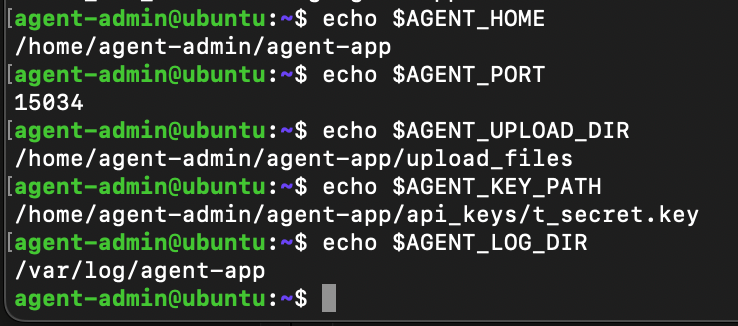

### 4.4 키 파일 생성
```
agent-admin@ubuntu:~$ echo "agent_api_key_test" > $AGENT_KEY_PATH
```

### 4.5 키 파일 검증
```
agent-admin@ubuntu:~$ cat $AGENT_KEY_PATH
agent_api_key_test
agent-admin@ubuntu:~$ ls -l $AGENT_KEY_PATH
-rw-rw----+ 1 agent-admin agent-core 19 May 18 17:57 /home/agent-admin/agent-app/api_keys/t_secret.key
agent-admin@ubuntu:~$ 
```

### 4.6 애플리케이션 실행
```
gent-admin@ubuntu:~$ $AGENT_HOME/agent-app
>>> Starting Agent Boot Sequence...
[1/5] Checking User Account               [OK]
 ... Running as service user 'agent-admin' (uid=1000)
[2/5] Verifying Environment Variables     [OK]
 ... All required Envs correct
[3/5] Checking Required Files             [OK]
 ... Verified 'secret.key' with correct key string.
[4/5] Checking Port Availability          [OK]
 ... Port 15034 is available.
[5/5] Verifying Log Permission            [OK]
 ... Log directory is writable: /var/log/agent-app
------------------------------------------------------------
All Boot Checks Passed!
Agent READY
2026-05-18 18:03:29,167 [INFO] [SafetyGuard] Process priority lowered (nice=10).
2026-05-18 18:03:29,167 [INFO] Agent listening at port 15034
```
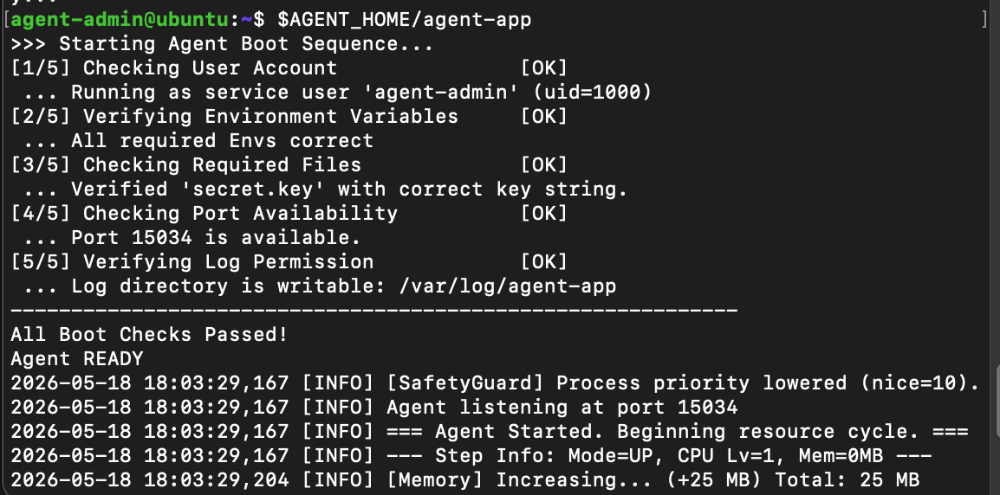

### 4.7 포트 LISTEN 상태 확인
```
yejoo031053822@ubuntu:~$ sudo ss -tulnp | grep 15034
tcp   LISTEN 0      1                  0.0.0.0:15034      0.0.0.0:*    users:(("agent-app",pid=5580,fd=4))      
yejoo031053822@ubuntu:~$
```
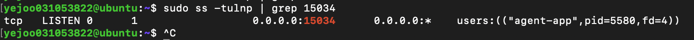


---
## 5. 시스템 관제 자동화 스크립트(monitor.sh) 구현
### 5.1 monitor.sh 실행 결과
```
aagent-admin@ubuntu:~$ /home/agent-admin/agent-app/bin/monitor.sh
====== SYSTEM MONITOR RESULT ======

[HEALTH CHECK]
Checking process 'agent-app'... [OK] (PID: 685)
Checking port 15034... [OK]

[RESOURCE MONITORING]
CPU Usage : 1.6%
MEM Usage : 4.3%
DISK Used  : 1%

[INFO] Log appended: /var/log/agent-app/monitor.log
agent-admin@ubuntu:~$ 
```

### 5.2 /var/log/agent-app/monitor.log 누적 기록 확인(최근 라인)
```
agent-admin@ubuntu:~$ tail -n 10 /var/log/agent-app/monitor.log
[2026-05-19 13:54:17] PID:651 CPU:1.6% MEM:4.1% DISK_USED:1%
[2026-05-19 14:48:38] PID:685 CPU:1.6% MEM:3.8% DISK_USED:1%
[2026-05-19 14:48:41] PID:685 CPU:1.6% MEM:4.3% DISK_USED:1%
agent-admin@ubuntu:~$ 
```  
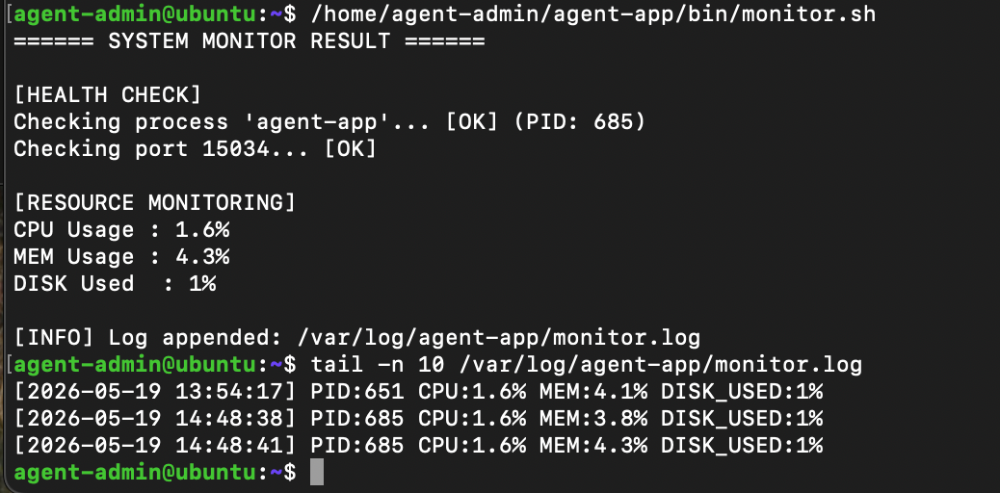

---
## 6. logrotate 설정
### 6.1 목적
`monitor.log`가 무한정 커지지 않도록 logrotate로 로그 파일 용량 관리 정책을 만들었다.
로그가 계속 커지면 디스크 용량 부족, 로그 확인 속도 저하 등의 문제가 발생할 수 있어 운영 서버에서는 보통 로그 파일을 일정 기준으로 나눠서 보관한다. 이를 로그 로테이션(log rotation)이라고 한다.

`/var/log/agent-app/monitor.log`가 계속 커지다가 10MB를 넘으면 기존 파일을 백업 파일로 돌리고, 새 `monitor.log`에 다시 기록하게 만들고, 이 로그 파일을 최대 10개 유지하도록 설정하였다.

logrotate는 로그 파일이 일정 조건을 만족하면 기존 로그 파일을 이름 바꿔 보관하고, 새 로그 파일을 만들거나 기존 파일을 비워서 이어서 기록한다.

### 6.2 설정 파일 생성
```
yejoo031053822@ubuntu:~$ sudo vim /etc/logrotate.d/agent-app-monitor
```
- logrotate 설정 파일을 만들어서 작성하는 명령어이다.
- `/etc/logrotate.d/`는 logrotate 개별 설정 파일들이 들어가는 디렉토리이다. 여기에 파일을 만들면 logrotate가 실행될 때 해당 설정을 읽는다.

### 6.3 현재 설정 파일 내용
```
yejoo031053822@ubuntu:~$ cat /etc/logrotate.d/agent-app-monitor
/var/log/agent-app/monitor.log {
    size 10M
    rotate 10
    missingok
    notifempty
    copytruncate
    create 660 agent-admin agent-core
}
```
- `/var/log/agent-app/monitor.log`: 설정이 적용될 대상 파일이다. 중괄호 안에는 이 파일에 적용할 정책을 작성한다.
- `size 10M`: 로그 파일 크기가 10MB 이상이면 rotate하라는 뜻이다.
- `rotate 10`: 회전된 로그 파일을 최대 10개까지 보관하라는 뜻이다.
- `missingok`: 로그 파일이 없어도 에러로 처리하지 말라는 뜻이다. 예를 들어 아직 `monitor.sh`가 한번도 실행되지 않은 경우 `monitor.log`가 없을 수도 있는데 이때 에러를 내지 말라는 의미이다.
- `notifyempty`: 로그 파일이 비어 있으면 rotate하지 말라는 뜻이다.
- `copytruncate`: 일반적인 로그 로테이션은 기존 파일 이름을 바꾸고 새 파일을 만든다. 그런데 어떤 프로세스는 이미 열어둔 파일 핸들에 계속 로그를 쓰기도 한다. 그 경우 파일 이름만 바꾸면 프로세스가 새 `monitor.log`가 아니라 예전 파일에 계속 쓸 수 있습니다. 이런 문제를 해결하기 위해 현재 `monitor.log` 내용을 `monitor.log.1`로 복사하고, 기존 `monitor.log` 파일은 그대로 두고 내용만 비우는 방식으로 동작한다. 즉, 파일 자체를 바꾸기보다 내용을 복사한 뒤 원본 파일을 비우는 방식이다. 이러면 `monitor.sh`가 계속 같은 경로에 로그를 기록하더라도 문제가 발생하지 않는다. 이번 스크립트는 실행할 때마다 파일을 새로 열어서 쓰기 때문에 copytruncate가 절대 필수는 아니지만, 로그 관리 설정으로는 안전한 선택이다. (매분 스크립트를 시작해서 실행하고 종료하는 방식이라서 파일에서 나가짐)
- `create 660 agent-admin agent-core`: 새 로그 파일을 만들 때 권한과 소유자를 지정한다. 다만 현재 설정은 `copytruncate`를 이용해서 기존 파일에 계속 작성하는 방식이라 크게 의미 있는 설정은 아니다.

---
## 7. crontab 매분 실행 및 자동 실행 확인
### 7.1 목적
모니터링을 사람이 직접 실행하지 않아도 서버가 주기적으로 상태를 기록하게 만들기 위해 자동 실행을 설정한다.

`cron`은 리눅스에서 정해진 시간마다 명령어를 자동 실행하는 예약 실행 도구이다. 이번 과제에서는 `agent-admin`의 crontab에 등록해서 `monitor.sh`를 매분 실행한다.
그러면 사람이 직접 실행하지 않아도 매분 자동으로 상태를 점검하고 로그를 남긴다. 결과적으로 `/var/log/agent-app/monitor.log`에 계속 로그가 쌓입니다. 이렇게 쌓인 로그는 나중에 장애 분석의 근거가 된다.

`crontab`은 cron이 참고하는 예약 작업 목록으로 언제 어떤 명령을 실행할지 적어둔 표이다.
즉, `cron`이 `crontab`을 읽고, `crontab`에 적힌 시간 규칙에 맞춰 명령어를 실행한다.

### 7.2 사전설정
`cron`이 있는지, 활성화되어 있는지 확인한다.
```
agent-admin@ubuntu:~$ systemctl is-active cron
active
agent-admin@ubuntu:~$ 
```

cron 실행 계정이 `agent-admin`이므로 `agent-admin` 계정으로 들어가서 설정해야한다.

### 7.3 `crontab` 매분 실행 설정
```
agent-admin@ubuntu:~$ crontab -e
no crontab for agent-admin - using an empty one

Select an editor.  To change later, run 'select-editor'.
  1. /usr/bin/vim.basic
  2. /usr/bin/vim.tiny

Choose 1-2 [1]: 1
crontab: installing new crontab
agent-admin@ubuntu:~$
```
- `crontab -e`: 현재 사용자 계정의 crontab을 편집하는 명령어

### 7.4 `crontab` 목록 확인
```
agent-admin@ubuntu:~$ crontab -l
# Edit this file to introduce tasks to be run by cron.
# 
# Each task to run has to be defined through a single line
# indicating with different fields when the task will be run
# and what command to run for the task
# 
# To define the time you can provide concrete values for
# minute (m), hour (h), day of month (dom), month (mon),
# and day of week (dow) or use '*' in these fields (for 'any').
# 
# Notice that tasks will be started based on the cron's system
# daemon's notion of time and timezones.
# 
# Output of the crontab jobs (including errors) is sent through
# email to the user the crontab file belongs to (unless redirected).
# 
# For example, you can run a backup of all your user accounts
# at 5 a.m every week with:
# 0 5 * * 1 tar -zcf /var/backups/home.tgz /home/
# 
# For more information see the manual pages of crontab(5) and cron(8)
# 
# m h  dom mon dow   command
* * * * * /home/agent-admin/agent-app/bin/monitor.sh >> /var/log/agent-app/monitor-cron.log 2>&1
agent-admin@ubuntu:~$
```
- `crontab -l`: 현재 사용자 계정의 crontab 목록을 출력하는 명령어
- `* * * * * /home/agent-admin/agent-app/bin/monitor.sh >> /var/log/agent-app/monitor-cron.log 2>&1`
  - `* * * * *`: cron의 앞 5칸은 실행 시간을 의미한다. 이는 매분 실행을 뜻한다.
      | 위치 | 의미 |	값 *의 뜻 |
      |---|---|---|
      | 1번째 |	분 | 매분 |
      | 2번째 |	시 | 매시간 |
      | 3번째 |	일 | 매일 |
      | 4번째	| 월 | 매월 |
      | 5번째 | 요일 | 매요일 |
  - `/home/agent-admin/agent-app/bin/monitor.sh`: cron이 실행할 명령어, 즉, 매분마다 `monitor.sh`를 실행
  - `>> /var/log/agent-app/monitor-cron.log`: 표준 출력(stdout)을 파일에 누적 저장하라는 뜻
  - `2>&1`: 에러 출력(stderr)도 일반 출력(stdout)과 같은 곳으로 보내라는 뜻으로, 결과적으로 일반 출력과 에러 출력이 모두 이 파일에 저장하게 된다.

### 7.5 검증
```
agent-admin@ubuntu:~$ tail -n 10 /var/log/agent-app/monitor.log
[2026-05-19 13:54:17] PID:651 CPU:1.6% MEM:4.1% DISK_USED:1%
[2026-05-19 14:48:38] PID:685 CPU:1.6% MEM:3.8% DISK_USED:1%
[2026-05-19 14:48:41] PID:685 CPU:1.6% MEM:4.3% DISK_USED:1%
[2026-05-19 15:06:55] PID:764 CPU:100.0% MEM:3.6% DISK_USED:1%
[2026-05-19 15:18:37] PID:840 CPU:1.6% MEM:3.6% DISK_USED:1%
[2026-05-19 15:18:40] PID:840 CPU:100.0% MEM:4.1% DISK_USED:1%
[2026-05-19 15:37:01] PID:924 CPU:100.0% MEM:4.0% DISK_USED:1%
[2026-05-19 15:38:01] PID:924 CPU:7.9% MEM:4.4% DISK_USED:1%
[2026-05-19 15:39:02] PID:924 CPU:100.0% MEM:3.2% DISK_USED:1%
agent-admin@ubuntu:~$ 
agent-admin@ubuntu:~$ tail -f /var/log/agent-app/monitor.log
[2026-05-19 14:48:41] PID:685 CPU:1.6% MEM:4.3% DISK_USED:1%
[2026-05-19 15:06:55] PID:764 CPU:100.0% MEM:3.6% DISK_USED:1%
[2026-05-19 15:18:37] PID:840 CPU:1.6% MEM:3.6% DISK_USED:1%
[2026-05-19 15:18:40] PID:840 CPU:100.0% MEM:4.1% DISK_USED:1%
[2026-05-19 15:37:01] PID:924 CPU:100.0% MEM:4.0% DISK_USED:1%
[2026-05-19 15:38:01] PID:924 CPU:7.9% MEM:4.4% DISK_USED:1%
[2026-05-19 15:39:02] PID:924 CPU:100.0% MEM:3.2% DISK_USED:1%
[2026-05-19 15:40:01] PID:924 CPU:15.9% MEM:4.4% DISK_USED:1%
[2026-05-19 15:41:01] PID:924 CPU:15.9% MEM:3.8% DISK_USED:1%
[2026-05-19 15:46:02] PID:1129 CPU:8.2% MEM:3.6% DISK_USED:1%
```
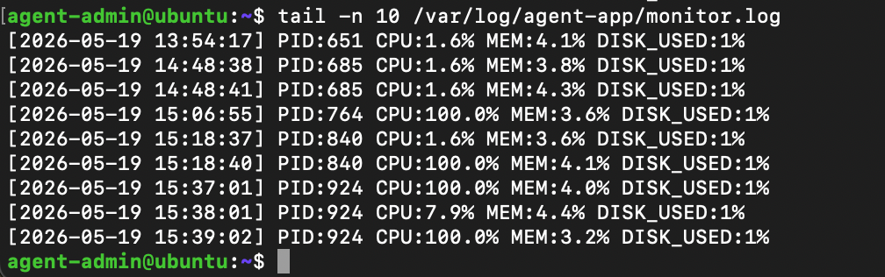
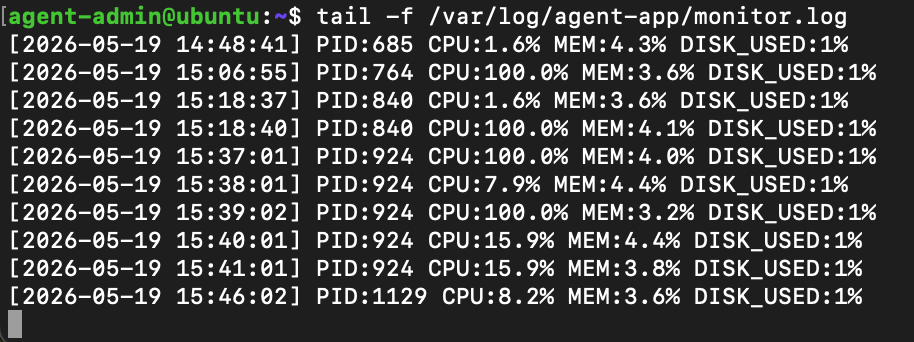

## 8. 필수 증거 자료 체크리스트
- [x] SSH 포트 변경(20022) 및 Root 원격 접속 차단 설정 확인 내역
- [x] 방화벽(UFW 또는 firewalld) 활성화 및 20022/tcp, 15034/tcp만 허용 내역
- [x] 계정/그룹(agent-admin/dev/test, agent-common/core) 생성 확인 내역
- [x] 디렉토리 구조 및 권한(ACL 포함) 확인 내역
- [x] 앱 Boot Sequence 5단계 [OK] 및 “Agent READY” 확인 내역
- [x] monitor.sh 실행 결과(프로세스/포트/리소스/경고) 내역
- [x] /var/log/agent-app/monitor.log 누적 기록 확인(최근 라인) 내역
- [x] crontab 매분 실행 등록 및 자동 실행 확인(1분 후 로그 증가) 내역
